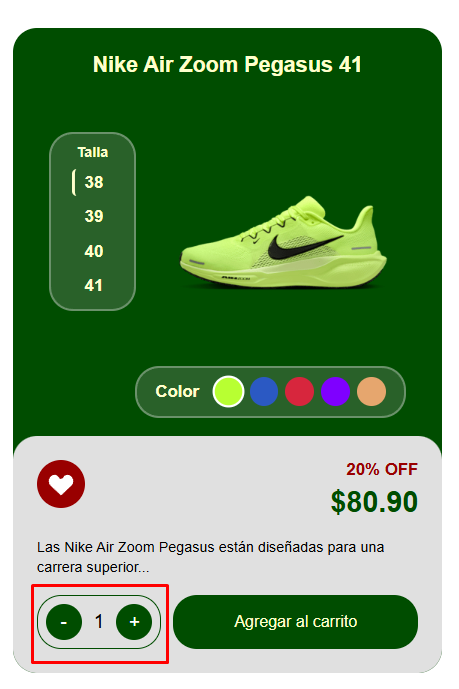
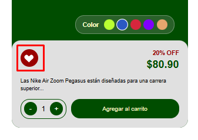
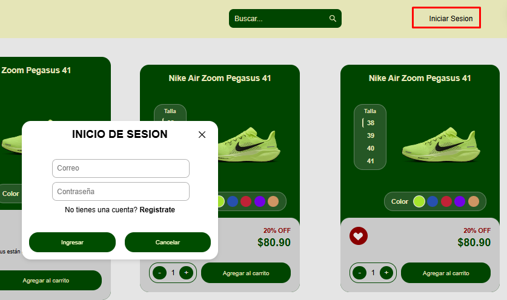
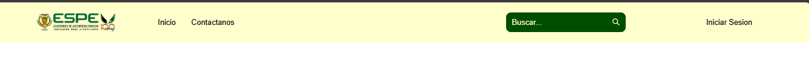

# Proyecto: Sistema de Autenticación y Navegación ESPE 

Este proyecto es una aplicación web desarrollada con **LitElement** que simula un sistema de autenticación y navegación para la ESPE. Incluye componentes reutilizables como barra de navegación, formularios de inicio de sesión y registro, y campos de entrada personalizados.

## Características principales

- **Barra de navegación** con logo, enlaces y buscador.
- **Diálogos modales** para iniciar sesión y registrarse, con validación de campos.
- **Componentes personalizados** para inputs y botones, con estilos modernos.
- **Gestión de usuario** simulada y comunicación entre componentes usando eventos personalizados.

## Estructura

- `components/complex/`: Componentes principales como navbar, login y register.
- `components/moleculars/`: Componentes importantes para construcción de paginas.
- `components/atomic/`: Componentes reutilizables como inputs y botones.
- `components/layout/`: Componentes de plantilla para las paginas.
- `models/`: Modelos de datos como el usuario.

## Uso

1. Clona el repositorio.
2. Instala dependencias si es necesario.
3. Abre el proyecto en tu entorno de desarrollo y ejecuta un servidor local.
4. Interactúa con la barra de navegación para iniciar sesión o registrarte.

---
Este proyecto es una base para prácticas de integración de componentes web y autenticación
---
# 1 Componentes Atómicos `(atomic)`:

## carpeta alerts

```bash
Ruta: src/components/atomic/alert
```

## Ejemplo de Componentes Atómicos:

- Componente: espe-alerts.js

```bash
Ruta: src/components/atomic/alerts/espe-alerts.js
```  
### Descripción:

- Este componente es un sistema de alertas visuales que muestra mensajes de éxito o error en la pantalla.

Uso: Puedes utilizar este componente para mostrar mensajes informativos al usuario. El tipo de mensaje (success, error) y el texto son configurables a través de las propiedades.

> Implementación:

```html
<espe-alerts id="alert"></espe-alerts>
```

```js
const alert = document.getElementById('alert');
alert.showAlert('success', '¡Compra realizada con éxito!');
```
## Propiedades:

- type: Tipo de alerta (success, error).

- message: El mensaje que se muestra.

- isVisible: Determina si la alerta es visible o no.

# `carpeta buttons`

## Componente: `cart-counter.js`

```bash
Ruta: src/components/atomic/buttons/cart-counter.js
```  

- Descripción: Muestra un contador de productos en el carrito.

- Este componente permite al usuario incrementar o decrementar la cantidad de un artículo en su carrito de compras.

### Implementación:

```html 
<cart-counter></cart-counter>
```
### `Métodos`

- increment(): Aumenta el contador.

- decrement(): Disminuye el contador (no permite valores negativos).

  

## Componente: `fav-button.js`

```bash
Ruta: src/components/atomic/buttons/fav-button.js
```

- Este componente es un botón de favorito que permite al usuario marcar un producto como favorito.
- Al hacer clic en este botón, se cambia su estado de activo a inactivo, utilizando la propiedad `active`.
  
 ```html 
<fav-button></fav-button>
```
### Métodos
- toggleActive(): Cambia el estado del botón entre activo e inactivo.

  


## Componente: ` log-button.js`

```bash
Ruta: src/components/atomic/buttons/log-button.js
```
- Este componente es un botón genérico utilizado para realizar acciones como iniciar sesión o registrarse. Se personaliza mediante el contenido del slot.
  
- Puedes utilizar este componente para crear un botón que contenga texto dinámico, como "Iniciar sesión" o "Registrarse". El contenido del botón se pasa a través del slot.

  ### Implementación
  
 ```index 
<log-button>Iniciar sesión</log-button>
```
### Estilos
---
El componente tiene un estilo con fondo verde (#004D00) y texto en color crema (#FFFFCC). El botón tiene un borde redondeado y un tamaño de 100% de ancho, lo que hace que se ajuste a su contenedor. 

# Carpeta inputs

## Componente: ` form-input.js`

```bash 
Ruta: src/components/atomic/inputs/form-input.js
```

- Este componente es un campo de entrada personalizado para formularios. Permite al usuario ingresar datos con validación visual (errores y éxitos). Además, se puede personalizar con atributos como placeholder, id, name, y type (que determina el tipo de campo como texto, contraseña, etc.).
-  Se utiliza para crear campos de entrada en formularios, con la capacidad de manejar diferentes tipos de campos y mostrar mensajes de error o éxito en función del estado del campo.

  ### Implementación
  
 ```index 
<form-input placeholder="Ingresa tu nombre" id="username" name="username" type="text"></form-input>
```
### Estilos

- El componente tiene bordes redondeados con un color gris claro y un padding en el campo de entrada para hacerlo más accesible.

- El estado de error (rojo) y éxito (verde) se visualizan con bordes de color correspondiente y cambios en el placeholder.
  
## Carpeta search 

### Componente: nav-search.js

```bash
Ruta: src/components/atomic/search/nav-search.js
```

- Este componente es una barra de búsqueda que permite al usuario ingresar texto para realizar búsquedas. Incluye un ícono de lupa en el lado derecho y un fondo verde con texto en color blanco.
- Se utiliza para agregar una funcionalidad de búsqueda en la navegación o en cualquier sección de la aplicación.
  
### Implementación 
```html  
<nav-search></nav-search>
```
### Estilos
---
Fondo verde (#004D00) con texto en color blanco (#FFFFCC).

El input no tiene bordes y tiene un estilo limpio, con el ícono de búsqueda en el lado derecho.
--- 

# 2. Componentes Moleculares `(moleculars)`:

```bash 
Ruta: src/components/moleculars/
```

-  Un botón genérico utilizado para iniciar sesión o realizar otras acciones.
-  Este botón es personalizable mediante el contenido del slot.
  
 ```html 
<log-button>Iniciar sesión</log-button>
```
  

## Ejemplo de Componentes Moleculares:

### Componente: `product-card.js`

```bash 
Ruta: src/components/moleculars/product-card.js
```
- Descripción: Muestra la tarjeta de un producto con su nombre, precio, descuento y una descripción breve.

- Este componente es útil para mostrar productos en una tienda en línea.
  
```html  
<product-card title="Nike Air Zoom Pegasus 41" price="80.90" discount="20" extended>
  Las Nike Air Zoom Pegasus están diseñadas para una carrera superior...
</product-card>
```
### Propiedades:

- `title`: Título del producto.

- `price`: Precio del producto.

- `discount`: Descuento aplicado.

- `extended`: Si se activa, muestra una descripción más extensa del producto.
  
  
### Componente: `product-modal.js`

```bash 
Ruta: src/components/moleculars/product-modal.js
```

- Este componente representa un modal que se abre para mostrar los detalles de un producto. Permite seleccionar el color, talla, y ver la descripción del producto. Además, incluye un botón para agregar el producto al carrito de compras y un botón de favorito.
- Se utiliza para mostrar un modal detallado con la información de un producto. El modal incluye una imagen, opciones de tamaño y color, una descripción detallada del producto y un botón para agregarlo al carrito.
  
 ### Implementación
  
```html 
<product-modal></product-modal>

```
### Propiedades 

> isOpen: Define si el modal está abierto o cerrado.

> image: La imagen del producto que se muestra en el modal.

> title: El nombre del producto.

> isFav: Indica si el producto está marcado como favorito.

> discount: El descuento aplicado al producto.

> price: El precio del producto.

> colors: Lista de colores disponibles para el producto.

> selectedColor: El color seleccionado actualmente.

> sizes: Lista de tallas disponibles.

> selectedSize: La talla seleccionada actualmente.

> description: Descripción detallada del producto.

## Funciones clave 

- changeColor(color): Cambia el color y la imagen del producto cuando se selecciona un color diferente.

- openModal(): Abre el modal.

- closeModal(): Cierra el modal.

- handleContentClick(e): Previene que un clic en el contenido del modal cierre el modal.

### Estilos 

El modal tiene una capa de fondo semitransparente (overlay) que oscurece el contenido de la página.

El contenido del modal se muestra con un borde redondeado y tiene una transición suave para la apertura y cierre.

El modal incluye áreas de selección de talla y color, que se presentan como botones interactivos.

# 3. Componentes Complejos  `(complex)`:

```bash 
Ruta: src/components/complex/
```
# Carpeta complex

## Ejemplo de Componentes Complejos:

### Componente: `espe-footer.js` 

```bash 
Ruta: src/components/complex/espe-footer.js
```

- Descripción: Este componente es el pie de página de la aplicación.

- El pie de página contiene información de derechos de autor y otros detalles importantes.

### Implementación

```html  
<espe-footer></espe-footer>
```
> Estilo: Fondo rojo y texto blanco centrado en la parte inferior de la pantalla.

  

### Componente: `espe-navbar.js`

```bash 
Ruta: src/components/complex/espe-navbar.js
```

- Descripción: Barra de navegación con enlaces a las secciones principales y la opción de iniciar sesión o registrarse.

- Este componente se coloca generalmente en la parte superior de la aplicación para facilitar la navegación entre secciones.
  
### Implementación

```html  
<espe-navbar></espe-navbar>
```
  

### Componente: `espe-aside.js`

```bash 
Ruta: src/components/complex/espe-aside.js
```

- Descripción:Este componente representa una barra lateral (aside) que muestra cupones con imágenes y detalles. La barra es estrecha por defecto y se expande cuando el usuario pasa el cursor sobre ella. Muestra información de descuentos o promociones en forma de cupones.

-  Se utiliza para mostrar información adicional, como cupones o anuncios, en una barra lateral fija.
  
### Implementación

```html
<espe-aside></espe-aside>
```

### Componente: `espe-loggin.js`

```bash 
Ruta: src/components/complex/espe-loggin.js
```

- Descripción: Este componente muestra un modal para el inicio de sesión. Incluye campos para ingresar correo y contraseña, con la opción de abrir el formulario de registro si el usuario no tiene cuenta. El modal se puede cerrar y manejar eventos de éxito de inicio de sesión.

- Se utiliza para permitir que los usuarios inicien sesión en la aplicación.
  
### Implementación

```html
<espe-loggin></espe-loggin>
```

### Componente: `espe-register.js`

```bash 
Ruta: src/components/complex/espe-register.js
```

- Descripción: Este componente muestra un modal para el registro de nuevos usuarios. Incluye campos para ingresar nombre, correo, contraseña y repetir la contraseña, con validaciones y la opción de abrir el formulario de inicio de sesión si el usuario ya tiene cuenta.

- Se utiliza para permitir que los usuarios se registren en la aplicación.
  
### Implementación

```html
<espe-register></espe-register>
```
  

# 4. Componentes Complejos  `(layout)`:

```bash 
Ruta:src/components/layout/espe-layout.js
```
## Ejemplo de Componentes de Layout:

### Componente: `espe-layout.js`

- Este componente es el contenedor principal de la aplicación, que organiza y agrupa otros componentes como el header y el footer. Es útil para mantener la estructura general de la página.
  
- Utiliza este componente para envolver el contenido de la página y agregarle la estructura general (header, footer, etc.).
  
### Implementación
```html  
<espe-layout>
  <!-- Contenido de la página -->
</espe-layout>
```
Este componente no tiene propiedades configurables. Se utiliza para contener y organizar otros componentes, como el pie de página o la barra de navegación, proporcionando la estructura base de la página. 

# 5. Componentes Complejos  `(models)`:


# Conclusiones

-  La organización de los componentes en carpetas como atomic, moleculars, complex y layout facilita la navegación y mantenimiento del código, lo que ayuda a tener  desarrollo más eficiente y escalable. Esta estructuración modular hace que sea fácil encontrar, modificar y reutilizar los componentes en diferentes partes de la aplicación.

- La estrategia de construir componentes reutilizables, como botones, alertas, formularios y tarjetas de productos, aumenta la flexibilidad y la consistencia en la aplicación. Los desarrolladores pueden enfocarse en nuevas funcionalidades sin tener que reescribir el mismo código,
